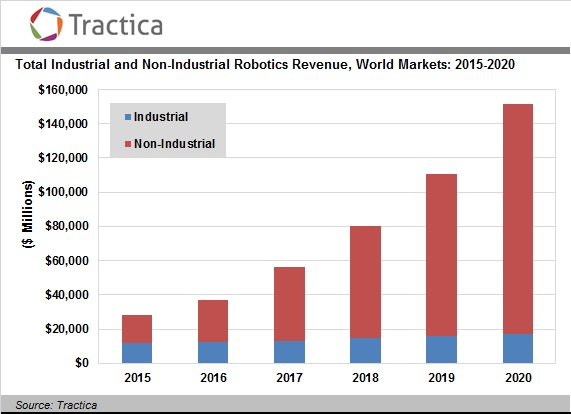

% UAS Team and UAV Team
% February 3, 2017

# The Future is Robotic

- The future is increasingly being automated and made robotic.

# The Future is Robotic

# The Future is Robotic

- Tractica is estimating about a $146 Billion world market for
  automation and robotics in 2020.

- Other estimates have been around $135 Billion.

- Which is a UPWARD adjustment from estimates in 2010 that predicted
  $110 Billion world market for automation and robotics.

# The Future is at SDSM&T

- The university has adjusted to advancing technologies with programs
  such as the Computational Sciences and Robotics Masters program, and classes
  such as ME 781 Robotics, CENG 452 Robotic Control Systems, CSC 415
  Introduction to Robotics, and many more.

- Student competition teams such as the Robotics Team, Unmanned Aerial
  Vehicle Team, and Unmanned Aircraft Systems Teams.

- Research projects hosted at the controls labs, computer vision labs,
  and intelligent flight systems labs.

# The Future is at SDSM&T

# UAS Teams and UAV Teams

- Although the names are similar, the goals, outcomes, team
  composition, and resources are very different.

# Different Goals (UAS Team)

- UAS Team is creating a competition open to universities and high
  schools interested in aerial robotics.

- The end product will be a new competition, to be hosted by SDSM&T.

- The challenges are in organizing and supporting groups both within
  and outside the university to participate.

# Different Goals (UAV Team)

- UAV Team is participating in the Association for Unmanned Vehicle
  Systems International (AUVSI) International Aerial Robotics
  Competition (IARC).

- The purpose of IARC is the challenge students to accomplish
  something never done before.  There's a fair bit of research
  required to participate in the competition in any meaningful way.

- The end product will be successful competition at the IARC, as well
  as any research that may have been performed in accomplishing this
  task.

# Different Outcomes (UAS Team)

- The competition created and hosted by UAS Team will increase
  SDSM&T's exposure to High School students and undergraduate students
  at other universities.

- This has the potential to raise the prestige of the university to a
  younger audience and attract the kind of future students who can
  keep these programs successful.

# Different Outcomes (UAV Team)

- The IARC competition brings together high performing, mainly
  research oriented teams.

- The teams, particularly from MIT, Georgia Tech, and Virginia Tech,
  typically are composed of PhD students, PhD researchers,
  post-doctoral researchers and industry partners.

{ width=50% } { width=50% }

# Different Outcomes (UAV Team)

- Successful participation in this competition has the potential to
  raise the prestige of the university, but is unlikely to attract new
  students.

- An expectation are that grad students will be able to generate
  thesis-worthy projects and research from this competition.

# Different Team Compositions

- UAS Team has members of all educational levels and provides
  opportunities for all students to participate.

- UAV Team is accepting of members of all educational levels, however
  the difficulty of the work often may be exclusionary for less
  educated or experienced members to contribute effectively.

- There are distinct personality differences between the teams, and
  each team brings together people with different motivations.

# Different Resources

Resource         | UAS Team   | UAV Team
-----------------|------------|----------------
Lab              | MC 113     | Foundation Bldg
Finances         | NASA, SOAP | Research Grant
Team Composition | Undergrad  | Thesis-Oriented Graduate

# Prior Precedent with Other Student Organizations

- Formula SAE and Baja SAE

# Prior Precedent with Other Student Organizations

{ width=50% } { width=50% }

# Conclusion

- The teams have different goals and outcomes.

- Each team provides different opportunities to improve and advertise
  the SDSM&T image that isn't possible alone.

- Eliminating one team or merging the teams will leave some students
  without a way to apply their motivations towards a constructive
  goal.

# Conclusion

- It's easy to destroy, hard to create, and almost impossible to
  inspire.

- What we want is to maintain two recognized student organizations,
  which inspire to create within the different groups.
